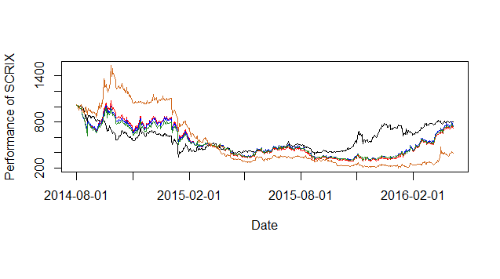

[](http://quantlet.de/index.php?p=info)

## [](http://quantlet.de/) **SCRIXplotsAndEvaluation** [](http://quantlet.de/d3/ia)

```yaml

Name of Quantlet : SCRIXplotsAndEvaluation

Published in : Unpublished; SCRIX

Description : 'Generate SCRIX'

Keywords : 'CRIX, SCRIX, index, cryptocurrency, crypto, plot'

See also : 'SCRIXgeneration'

Author : Lam Tuyen Nguyen, Wee Song Chua, Simon Trimborn

Submitted : Wed, Aug 17 2016 by Wee Song Chua

Datafile : 'crix.RData, scrix_CFes_return.RData, scrix_CFVaR_return.RData, scrix_equalweight.RData, 
scrix_es_return.RData, scrix_markport.RData, scrix_SR_CFes_return.RData, scrix_SR_CFVaR_return.RData, 
scrix_sr_es.RData, scrix_sr_var.RData, scrix_var_return.RData'

Example: Plot with the SCRIX family.
```


